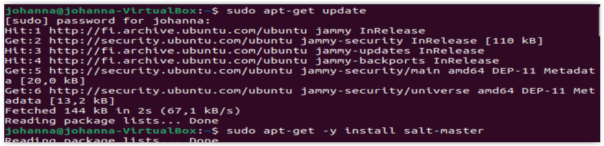
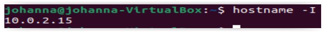
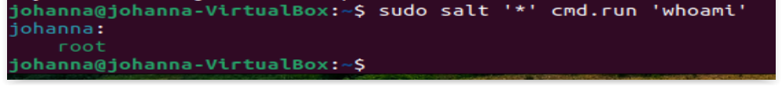
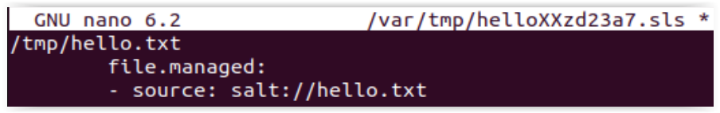
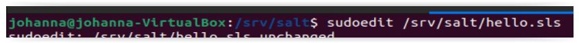
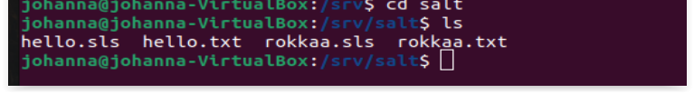
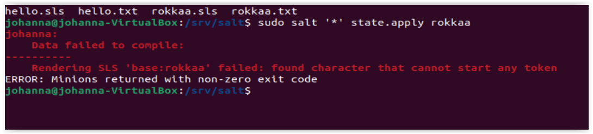
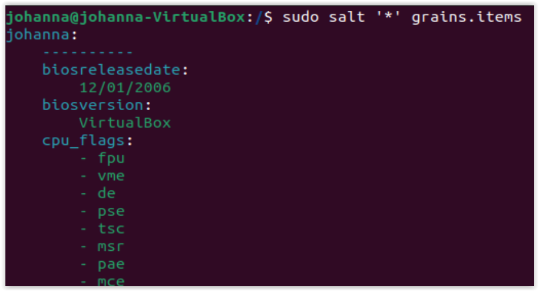

# h1 Hello Salt

Koneena Lenovo Legion Y530-15ICH, Intel Core i5-8300H CPU, 8GM RAM, Windows 11 Home Insider Preview 
Oracle VM VirtualBox 7.0. 
Ubuntu: 22.04.1 LTS, codename: jammy 

## x) Lue ja tiivistä (Tässä x-alakohdassa pelkkä luku / katselu / kuuntelu riittää, ei tarvitse tehdä testejä tietokoneella. Muutama ranskalainen viiva per artikkeli riittää)

<li>    Karvinen 2020: Command Line Basics Revisited</li>
<li>    Karvinen 2018: Salt States – I Want My Computers Like This</li>
<li>    Karvinen 2006: Raportin kirjoittaminen</li> 

a) Tee Saltilla tiedosto yksittäisellä komentorivillä (state.single)

b) Tee saltille idempotentti, infra koodina hei maailma (siis tiedostosta, /srv/salt/foo.sls)

d) Kerää tietoa koneesta saltin avulla (grains.items)

e) Kokeile jotain toista tilaa kuin file.managed. Tärkeitä ovat pkg.installed, file.managed, service.running, file.symlink, user.present, group.present. Ohjeita saa esim "sudo salt-call --local sys.state_doc pkg.installed|less"

## x) Karvinen 2020: Command Line Basics Revisited

on käsitelty erilaisia Linux komentoja.
Komentokehotteella pystyy näppärästi käyttämään tietokonetta. Sen avulla liikutaan hakemistojen välillä ylös- tai alaspäin, listataan tiedostoja ja hallitsemaan erilaisia operaatioita.

<b>Muistettavia tärkeitä komentoja</b>

### Hakemistoihin ja tiedostoihin liittyvät

pwd tulostaa työhakemiston näytölle
ls listaa työhakemiston sisällä olevat tiedostot
cd hakemistonimi/ siirryt tähän hakemiston
cd .. siirrytään yhtä ylemmäs hakemistoon
mkdir luodaan uusi hakemisto
mv nimetään vanha hakemisto tai tiedosto uudelleen
cp kopioidaan tiedosto
rm poistetaan tiedosto ja rmdir poistetaan hakemisto, mutta rm -r poistaa hakemiston ja sisällön ilman varoituksia (käytettävä varauksella ja ajatuksella)

### SSH yhteys - turvallinen, salattu yhteyden muodostus etäkoneeseen

Kirjoitetaan ssh käyttäjätunnus@omadomain.fi ja yhteys muodostetaan. Lopetus tapahtuu kirjoittamalla exit ja palaat omalle koneellesi.

### Apua ja lisäinfoa

man ls listaa yleisimmät komennot ja niiden lyhennykset, paina h ja saat lisäapua, q kirjain lopettaa
ls --help listaa tiedostojen nimet, tarkoitukset ja lyhenteet
wget -h antaa apuja verkkoasetuksiin

### Nimppelitietoa

Caps lockin yläpuolella oleva tabulaattori on erinomainen apuväline komentojen kirjoittamiseen. Ne näyttää seuraavat käytettävissä olevat vaihtoehdot ja näin vältytään usein tulevista näppäily- eli kirjoitusvirheistä. Esimerkiksi ls /etc/re[tab][tab] antaisi tulokseksi reportbug.conf resolvconf/ resolv.conf
Se voi antaa ehdotukseksi myös tiedoston nimen päätteen.
Suositeltavaa onkin käyttää tabulaattoria eteenkin pitkissä komentosarjoissa.

### Pääkäyttäjän oikeudet

sudo apt-get update (kysyy myös salasanan) tekee tarkistuksen jos on uusia päivityksiä käyttöjärjestelmälle saatavilla.
sudo apt-get upgrade päivittää käyttöjärjestelmän
sudo apt install (ohjelma) lataa ja asentaa ohjelman

## Salt States – I Want My Computers Like This

Voit Saltin avulla hallita useampia koneina. Sillä on kaksi pääkomponeittia, jolla käsittelee infrastuktuurin solmuja (master ja minions) ja hallintajärjestelmä pitää kaikki infrastuktuurin solmut määritellyssä tilassa. Tosin sanoen master eli pääpalvelin hallitsee alempia koneita toimimaan halutun mukaisesti. Ainoastaan master pitää olla julkinen palvelin ja osoite.

## Raportin kirjoittaminen

Mietitäänpä hetki raportin kirjoittamista. Se voi tuntua työläältä, kun sitä tehdään eri teknillisissä vaiheessa samalla. Kun siinä kertoo täsmällisestii ja tapahtumat vaiheittain on helpompi myöhemmin löytää virhe(eet) ja korjata. Mitä yksityiskohtaisemmin raportin teet, sen parempi. Silloin toistettavuus säilyy.
Väliotsikoita on hyvä käyttää. Se selkeyttää asioita ja on helpommin luettavissa.
Hyviin tapoihin kuuluu, että viittaukset laitetaan näkyville ja merkitään oikeaoppisesti.
Teksti, joka on muiden henkilöiden tekemää ja kopioit ilmoittamatta lähdettä on plagiointia ja loukkaa tekijänoikeuksia.

### Ennen tehtäviä aloitus Salt Quickstart – Salt Stack Master and Slave on Ubuntu Linux -ohjeiden mukaan

## Salt Masterin asennus

Ennen tehtävien tekemisiä päivitin tarkistin Ubuntun päivitykset (sudo apt-get update) ja asensin Saltin (sudo apt-get -y install salt-master). Otin myös hostin (hostname -I) IP:n 10.0.2.15 talteen.

## Salt orjan asennus

Koska olin jo hetki sitten päivittänyt Ubuntun jatkoin orjan asennukseen (sudo apt-get -y install salt-minion). Vuorooon tuli sitten uudelleenkäynnistäminen sudo systemctl restart salt-minion.service komennolla. Uudelleenkäynnistämisen jälkeen avasin minion, määrittelin masterille IP:ksi 10.0.2.15 ja id:ksi tuli johannankoti. sudo salt-key -A komennolla määrittelin avaimen orjalle ja kysymykseen prosessin eteenpäin menosta vastasin Y. Vielä tarkistus, kuka olen

# Tehtävänanto

## a) Tee Saltilla tiedosto yksittäisellä komentorivillä (state.single)

Ensiksi loin hakemiston tiedostojen tallennusta varten. Loin tiedoston nimeltä hello.sls, jonne määrittelin tietojen tulevan hello.txt

## b) Tee saltille idempotentti, infra koodina hei maailma (siis tiedostosta, /srv/salt/foo.sls)

Loin tiedoston rokkaa.sls ja rokkaa.txt.

State ei jostain syystä mennyt läpi, joten joudun sitä myöhemmin tarkistamaan.

## d) Kerää tietoa koneesta saltin avulla (grains.items)

sudo salt ‘\*’ grains.items komento antaa paljon tietoa. Kuvassa pieni pätkä.

## Kokeile jotain toista tilaa kuin file.managed. Tärkeitä ovat pkg.installed, file.managed, service.running, file.symlink, user.present, group.present. Ohjeita saa esim "sudo salt-call --local sys.state_doc pkg.installed|less"

Asensin pkg.install httpie ja sain alla olevan tuloksen

## Lähteet

Tätä dokumenttia saa kopioida ja muokata GNU General Public License v3.0 mukaisesti. https://www.gnu.org/licenses/why-not-lgpl.html

Pohjana Tero Karvinen 2022: "Palvelinten hallinta" kurssi
Palvelintenhallinta, terokarvinen.com: https://terokarvinen.com/2022/palvelinten-hallinta-2022p2/?from=MoodleNews#h1-hello-salt

Salt Quickstart – Salt Stack Master and Slave on Ubuntu Linux https://terokarvinen.com/2018/salt-quickstart-salt-stack-master-and-slave-on-ubuntu-linux/

Salt States – I Want My Computers Like This, terokarvinen.com: https://terokarvinen.com/2018/salt-states-i-want-my-computers-like-this/
